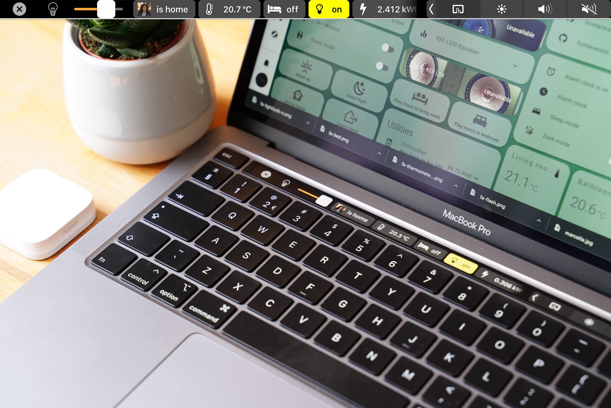
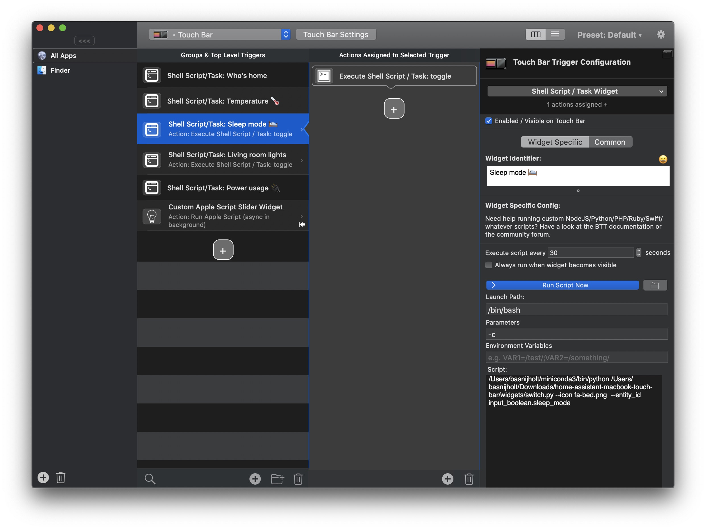

# home-assistant-macbook-touch-bar

Displaying Home Assistant sensors in the Macbook Pro's touch bar using BTT.

*See this [Reddit](https://www.reddit.com/r/homeassistant/comments/gyd5wd/finally_a_good_use_for_the_touch_bar_on_my/) thread.*

## Requirements

* Macbook Pro with touch bar (obviously 😅)
* install [BetterTouchTool](https://folivora.ai/downloads)
* clone/[download](https://github.com/basnijholt/home-assistant-macbook-touch-bar/archive/master.zip) this repository
* rename [widgets/secret-example.py](widgets/secret-example.py) to `widgets/secret.py` and fill in a token and URL

## Install a button widget

1. open BetterTouchTool
2. select Touch Bar (⌘1)
3. click on (+) sign
4. at "Select Trigger" → "Touch Bar Widgets" → "Shell Script / Task Widget"
5. at "Launch Path" leave `/bin/bash` and at "Parameters" leave `-c`
6. at "Script" add `FULL_PYTHON_PATH PATH_TO_WIDGET OPTIONAL_ARGUMENTS`, for the full Python path, use `which python`, e.g., `/usr/local/bin/python3 ~/Downloads/home-assistant-macbook-touch-bar/widgets/switch.py --entity_id light.living_room_lights --icon fa-lightbulb-o.png`

If the widget has an action associated with it, continue

7. at "Assigned Action(s)" click on "Click here & select action ►" → "Controlling Other Applications" → "Execute Shell Script / Task"
8. repeat step 5. and 6.
6. pass the right argument (e.g., add `--toggle`) to the script

## Examples

